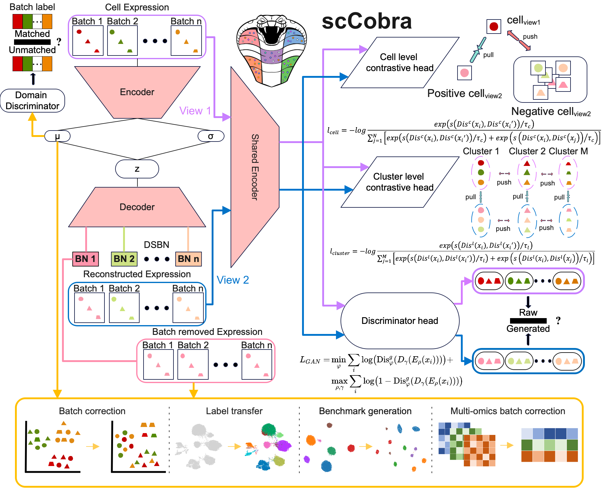

Welcome to scCobra's documentation!
===================================

**scCobra** is a deep learning-based model for single-cell data batch correction and data harmonization.

Contents
--------

.. toctree::
   :maxdepth: 2
   :caption: Contents:

   install
   tutorials
   api
